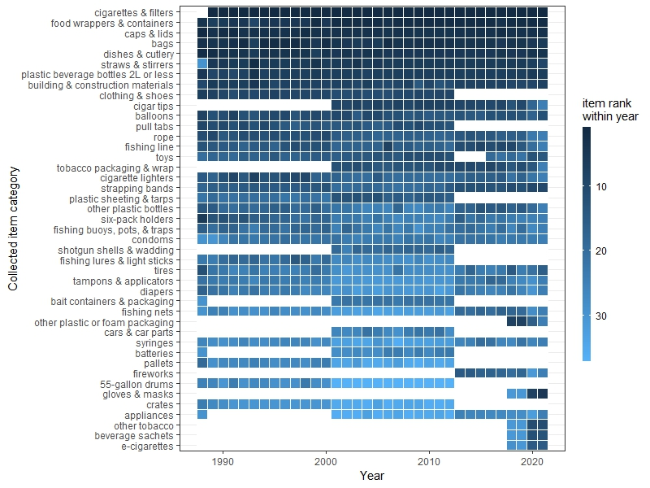

# CAplastics

Exploring patterns in CA's plastics data from cleanup efforts. Repo is under construction.

{width="600"}

## Project workflow

I currently work in a .Rproj, with subfolders 'data', 'figures', and 'scripts' where each is respectively kept. I use here() to access these folders & save in them.

## Notes about the data & visualizations

Ongoing outlines & to-do lists for work items are available in issues.

### Raw datasets

**Coastal Cleanup Day (CCD)**: The data is stored in the 'data' folder as "Coastalcleanupday_data.xlsx". The visualizations for these data are in explore_ccd.R, which is unfortunately messy but it gets the job done.

**Ocean Conservancy (OC)**: The data is stored in the 'data' folder as "OceanConservancy_CA.xlsx". The visualizations for these data are in explore_oc.R, which is also messy.

### Edited/created datasets

coarse_data_relational_table.xlsx -- created to relate data types within the CCD and OC datasets. Both datasets are wrangled in fig_coarse_heatmap.R and plotted.

OceanConservancy_CA_WithDistance.csv -- gives distance to the ocean of each cleanup in the OC dataset. This dataset was created by Michelle Tang using a Jupyter notebook, gis_for_trash_cleanup.ipynb.
